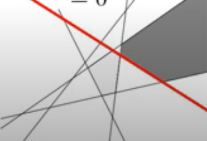
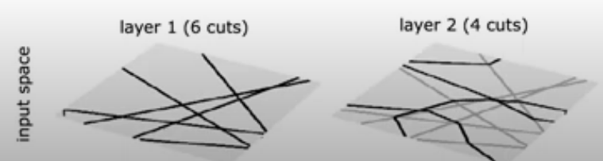
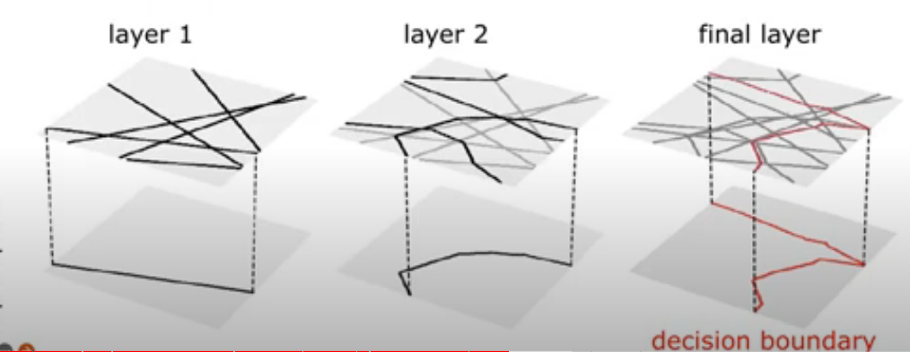

I am sure that by now you have heard the jokes and seen the memes that AI is essentially just a bunch of  `if` `else` statements. Take this tweet below:

<blockquote class="twitter-tweet">
&quot;Uber will use artificial intelligence to identify drunk passengers. It will use factors like time of day, pickup location, and how long a user interacts with the app before making a decision.&quot;  That&#39;s not AI. That&#39;s an if statement.
&mdash; @Nick_Craver@infosec.exchange (@Nick_Craver) <a href="https://twitter.com/Nick_Craver/status/1005033951482834945?ref_src=twsrc%5Etfw">June 8, 2018</a></blockquote> 

Obviously this is a gross oversimplification of what AI can do. But because of all of the hype, many have been quick to belittle or poke holes the actual power of AI applications like deep learning. In my opinion, a lot of this stems from the fact that even several years after the mainstream adoption of deep learning applications and capabilities, they still represent a *black box* system: a model takes millions of data points as inputs and correlates specific data features to produce an output. That process is largely self-directed and is generally difficult for data scientists, programmers and users to interpret.

Similarly, this difficulty can be stated from a more theoretical perspective: On an infinite input domain like $\mathbb{R}^n$, no finite number of samples is enough to uniquely determine a single function, even approximately. Even accounting for bounds and discretization of the input, and even for the symmetries our architectures impose on the output function, our training sets are microscopic compared to the sizes of our input domains. The problem that neural networks successfully solve every day should be impossible.

#### A Lack of Theory
This lack of explainability has given rise to a subset of deep learning  that specifically seeks to address and develop methods to make machine and deep learning systems more understandable. The most notable would be , SHAP (SHapley Additive exPlanations) a game theoretic approach to explain the output of any machine learning model. Yet these efforts have not addressed the underlying yet pronounced lack of theory explaining why deep learning works so well. Take for example, this excerpt from a paper aptly titled "Why does deep and cheap learning work so well?":

> However, it is still not fully understood why deep learning works so well. In contrast to GOFAI (“good old-fashioned AI”) algorithms that are hand-crafted and fully understood analytically, many algorithms using artificial neural networks are understood only at a heuristic level, where we empirically know that certain training protocols employing large data sets will result in excellent performance.

Put even more bluntly in a NeurIPS 2017 presentation:
> Batch Norm is a technique that speeds up gradient descent on deep nets... Batch Norm has become a foundational operation for machine learning. It works amazingly well. **But we know almost nothing about it.**

Clearly, this was a somewhat lighthearted talk that didn't put heavy emphasis on nuance. The claim that "we know almost nothing" about Batch Norm was probably not meant to be taken literally. However, it's been taken both seriously and literally by much of our community as a statement about our then-current (i.e. as of 2017) best scientific understanding. But it is hard to give a succinct summary of what Batch Norm does, because there are multiple effects going on, and which ones are important in any particular case will depend on the specific task, optimization algorithm,
and architecture.

This example applies to the overall performance of neural networks, where despite their massive size, successful deep artificial neural networks often exhibit a remarkably small difference between training and test performance. The lack of a concise and singular explanation for this ability, coupled with a dearth of theoretical study of individual components, has allowed observers to claim that *"deep learning is not as impressive as you think because it’s mere interpolation resulting from glorified curve fitting."*

#### What is Interpolation (and Extrapolation)?

The success of deep learning has led to a lot of recent interest in understanding the properties of “interpolating” neural network models, that achieve (near-)zero training loss. Interpolation was first defined as predicting the possible realization of a stationary Gaussian process at a time position lying in-between observations. This is not to be confused with "extrapolation", defined as predicting the future (realization) of a stationary Gaussian process based on past and current realizations.
It is critical to distinguish between interpolation, and the idea of an interpolation regime,  which occur whenever the model has 0 training loss on the data.

Interpolation and extrapolation provide an intuitive geometrical characterization on the location of new samples with respect to a given dataset. Those terms are commonly used as geometrical proxy to predict a model's performances on unseen samples and many have reached the conclusion that a model's generalization performance depends on how a model interpolates. In other words, how accurate is a model within a dataset's convex-hull determines its generalization performances. 

To put it differently, conventional wisdom in machine learning offers the following about generalization:
1.  A model that is too simple will _underfit_ the true patterns in the training data, and thus, it will predict poorly on new data.
2.  A model that is too complicated will _overfit_ spurious patterns in the training data; such a model will also predict poorly on new data.

So then how can overparameterized and overfit deep learning models achieve good generalization? Furthermore, it has been proven that the behavior of a model within a training set's convex hull barely impacts that model's generalization performance since new samples lie almost surely outside of that convex hull. This observation holds whether we are considering the original data space, or embeddings. The argument is  essentially based on the well-known curse of dimensionality: in high dimension, every point is far from another. For example, in order to maintain a constant probability to be in interpolation regime, the training set size has to increase exponentially with $\mathbb{D}$ regardless of the underlying intrinsic manifold dimension where $\mathbb{D}$ is the dimension of the lowest dimensional affine subspace including the entire data manifold i.e. the convex hull dimension. Thus in high dimension, any new point almost surely lie outside of the training set convex hull. Therefore, finding samples in interpolation regime becomes exponentially difficult with respect to the considered data dimension, and dimensionality reduction methods loose the interpolation/extrapolation information and lead to visual misconceptions  skewed towards interpolation. 

Is it then a (mis)conception that state-of-the-art algorithms work so well because of their ability to correctly interpolate training data? If this is the case, then how come deep learning models generalize at all? Shouldn’t they just learn an ad hoc mapping between training inputs and targets, like a fancy dictionary? What expectation can we have that this mapping will work for new inputs?

#### How does this relate to a model's ability to generalize?
The critical component here that allows us to resolve the apparent contradiction between the inability to interpolate in high dimensional setting and a neural network's ability to generalize, is the idea of a *manifold*. A “manifold” is simply a lower-dimensional subspace of some parent space that is locally similar to a linear (Euclidian) space. (i.e. it is continuous and smooth). The fact that this property (latent space = very small subspace + continuous & structured) applies to so many problems is called the _manifold hypothesis_. More generally, the manifold hypothesis posits that all natural data lies on a low-dimensional manifold within the high-dimensional space where it is encoded. This concept is central to understanding the nature of generalization in ML.

The manifold hypothesis implies that
- Machine learning models only have to fit relatively simple, low-dimensional, highly structured subspaces within their potential input space (latent manifolds).
- Within one of these manifolds, it’s always possible to interpolate between two inputs, that is to say, morph one into another via a continuous path along which all points fall on the manifold.

As a result, you can use a _small subset_ of the latent space to fit a _curve_ that approximately matches the latent space. See this tweet of François Chollet from an epic and extremely informative twitter thread:
<blockquote class="twitter-tweet">
It&#39;s only with a sufficiently dense sampling of the latent manifold that it becomes possible to make sense of new inputs by interpolating between past training inputs without having to leverage additional priors. <a href="https://t.co/SmRvEN2NXS">pic.twitter.com/SmRvEN2NXS</a>
&mdash; François Chollet (@fchollet) <a href="https://twitter.com/fchollet/status/1450540673891913730?ref_src=twsrc%5Etfw">October 19, 2021</a></blockquote> 

So deep learning achieves (local) generalization via interpolation on a learned approximation of the data manifold. But what does this mean, from a practical perspective? 

#### Universal Approximation Theorem
The theorem states, in essence, that under a few conditions, any continuous function _f_ can be modelled with a neural network with one hidden layer and a sufficient number of units. One of the requirements is that the activation function must have some form of nonlinearity. The Universal Approximation Theorem at most implies that neural networks are a reasonable model, but does not suggest that they are superior to other methods (e.g. polynomials, splines, wavelets, Fourier expansions, ...).

There's some further ways to break down the Universal approximation theorem. For example, it requires the activation function be nonconstant, bounded, and monotonically-increasing continuous function. Take the case of the sigmoidal activation, which asymptotes out to 0 as x→−∞ and to 1 as x→+∞. One of the original motivations for using the sigmoidal activation was that it can act like a switch. Allowing the weights to have arbitrary magnitude, i.e. no hard limit on the size of the parameter values, we can effectively shift sigmoids into their "off" states with very negative values and shift sigmoids into their "on" states with very positive values. And training a single hidden layer corresponds to learning a good configuration of parameters. By allowing for the weights to have unbounded size (both in the negative and positive sense), we can interpret the single hidden layer NN as partitioning the domain into sub-spaces where a specific configuration of the sigmoidals are "on" and contribute to the function approximation and the others are switched "off." Now if we allow ourselves to have a ton of these sigmoids, you start to get some intuition as to why the sigmoidal Universal Approximation Theorem is true.

From the Universal Approximation Theorem, we understand that neural networks may not be ‘intelligent’ in the sense that humans often think of intelligence, but are complex estimators hidden under a guise of multidimensionality, which makes its ability — which would seem ordinary in two or three dimensions — seem impressive. 

Another way to think about it is to consider a neural network as a kind of ensemble. Every neural network has a pre-ultimate layer that you can think of as a collection of intermediate representations of your problem. The outputs of this layer are then aggregated (usually using a dense layer) for making the final prediction. This is like ensembling many smaller models. Again, if the smaller models memorized the data, even if each would overfit, by aggregating them, the effects would hopefully cancel out.

#### Putting it all Together

Each of these above mentioned intermediate layers, where we can learn a via a manifold of the latent space, allows us to separate the input space into exponentially more linear response regions than shallow networks, despite using the same number of computational units. This means that **representational capacity scales with depth**. Put another way, deep networks are able to _identify_ an exponential number of input neighborhoods by mapping them to a common output of some intermediary hidden layer. The computations carried out on the activations of this intermediary layer are replicated many times, once in each of the identified neighborhoods.

From a geometric perspective, each hidden layer of a deep neural network can be associated with a folding operator. Each hidden layer folds the space of activations of the previous layer. In turn, a deep neural network effectively folds its input-space recursively, starting with the first layer. The consequence of this recursive folding is that any function computed on the final folded space will apply to all the collapsed subsets identified by the map corresponding to the succession of foldings. This means that in a deep model any partitioning of the last layer’s image-space is replicated in all input-space regions which are identified by the succession of foldings. Space foldings are not restricted to foldings along coordinate axes and they do not have to preserve lengths. Instead, the space is folded depending on the orientations and shifts encoded in the input weights W and biases b and on the nonlinear activation function used at each hidden layer.

Consider a ReLU unit assigned to one of the hidden layers of a network, represented as follows:
$$z_{k}= ReLU(w_{k}\cdot x + b_k)$$
The area in the parenthesis (input to the ReLU) is the equation of a hyperplane:
- $w_K$ is the orientation of the hyperplane
- $b_k$ is the offset

This hyperplane is dividing the input space into two halves, one where the ReLU has a positive output, and the other where the ReLU output is zero. That is only for a single $k$ in a single layer- so for all $k$'s in a layer, it is going to put down multiple hyperplanes in high dimensional space to partition up the input into convex polytopes (polygons in high dimension). The below image shows the different hyperplanes of different $k$'s for a single layer, with the decision boundary as the red line and the different polytopes as shaded regions. 

For a second hidden layer, the hyperplanes are folded by the previous layer's hyperplanes to maintain continuity in mapping, through to the decision boundary:

 

So what is happening here is not *alchemy*. Rather, the model is applying a hyperplane for each neuron in each hidden layer, by utilizing subsequent manifolds of the latent space that represent the output of one layer and the input to the subsequent layer. The corresponding multidimensional decision boundaries layer by layer are interpolated together, much akin to how a spline behaves, and then *pulled together* in the final layer to create a decision boundary.  

---
**Sources**:
[^1]: Montúfar, G., Pascanu, R., Cho, K., & Bengio, Y.. (2014). On the Number of Linear Regions of Deep Neural Networks.
 
[^2]: Henry W. Lin, Max Tegmark, & David Rolnick (2017). Why Does Deep and Cheap Learning Work So Well?_. Journal of Statistical Physics, _168_(6), 1223–1247.
 
[^3]: P. H. P. Savarese, I. Evron, D. Soudry, and N. Srebro, “How do infinite width bounded norm networks look in function space?” in Conference on Learning Theory, COLT 2019, 25-28 June 2019, Phoenix, AZ, USA, 2019, pp. 2667–2690
 
[^4]: A Spline Perspective of Deep Learning - Richard Baraniuk - FFT Feb 28th, 2022 https://www.youtube.com/watch?v=5AMxhdj-96Q
 
[^6]: https://github.com/slundberg/shap
 
[^8]: Ali Rahimi. Back when we were young. NeurIPS Test of Time Talk, 2017.
 
[^9]: Wiener, N. (1949). Extrapolation, interpolation, and smoothing of stationary time series, with engineering applications.
 
[^10]: Chatterji, N. S., Long, P. M., and Bartlett, P. L. (2021). When does gradient descent with logistic loss find interpolating two-layer networks? Journal of Machine Learning Research, 22(159):1–48.
 
[^11]: Balestriero, R., Pesenti, J., & LeCun, Y.. (2021). Learning in High Dimension Always Amounts to Extrapolation.
 
[^12]: A feedforward network with a linear output layer and at least one hidden layer with any “squashing” activation function (such as the logistic sigmoid activation function) can approximate any function from one finite-dimensional space to another with any desired non-zero amount of error, provided that the network is given enough hidden units
